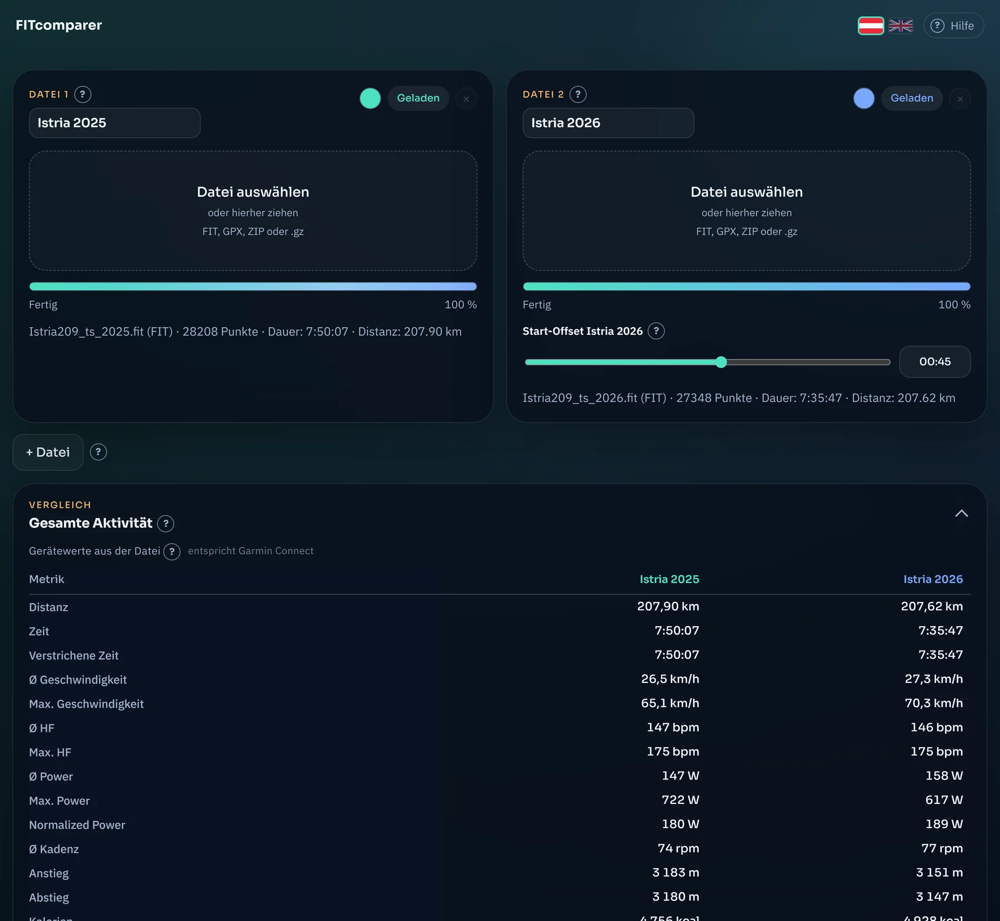

# FITcomparer

Vergleiche Aktivitäten von Garmin, Wahoo, COROS, Suunto, Polar, Strava und anderen (FIT, GPX oder das ZIP aus Garmin Connect) direkt nebeneinander: Kennzahlen, Karte, Graph und auf Wunsch als MP4-Video. Alles läuft in deinem Browser, deine Dateien werden nicht hochgeladen.

**App: <https://fit.scheipel.com>** · **Anleitung: <https://fit.scheipel.com/help.html>** · 🇬🇧 **English: <https://fit.scheipel.com/en/>** (**[guide](https://fit.scheipel.com/en/help.html)**)



## Was kann es?

- **Zwei bis sechs Aktivitäten** gleichzeitig vergleichen, jede mit eigenem Namen und eigener Farbe.
- **Gerätewerte wie in Garmin Connect** (aus der Zusammenfassung der FIT-Datei) und daneben **nachgerechnete Werte** aus den Sekundenwerten, inklusive Abweichungsanzeige.
- **Zeit- und Distanzfenster:** Kennzahlen für einen beliebigen Abschnitt, auch wenn die Aktivitäten ihn zu verschiedenen Zeiten gefahren sind.
- **Dateien per Drag & Drop** auf die Dateikarte ziehen oder über „Datei auswählen“ laden.
- **Start-Offset**, um ungleiche Startzeiten bei Rennen oder gemeinsamen Ausfahrten auszugleichen, auf Knopfdruck automatisch an einer gemeinsamen Startlinie.
- **Abstand zwischen den Markern** in km entlang der Strecke und als Rennabstand in Zeit, auch im Video.
- **Wiedergabe** mit wandernden Markern auf der Karte, Graph für Puls, Leistung, Geschwindigkeit, Distanz, Kadenz und Höhe.
- **MP4-Export** in 16:9, 4:3, 1:1, 4:5 und 9:16 mit frei wählbarem Kartenausschnitt.
- Kleine **?-Erklärungen** an den Bedienelementen und eine Ansicht für das Smartphone.

## Schnellstart

1. In **Garmin Connect (Webseite, nicht die App)** die Aktivität öffnen, auf das Zahnrad klicken und **„Datei exportieren“** wählen. Du erhältst ein ZIP.
2. FITcomparer öffnen und das ZIP bei „Datei 1“ auswählen. Es muss nicht entpackt werden. Dasselbe bei „Datei 2“.
3. Vergleichen.

FIT ist ein offener Standard: Dateien von Wahoo, COROS, Suunto, Polar, Hammerhead, Zwift oder der Strava-Funktion „Export Original“ lassen sich genauso laden, auch als `.fit.gz`. Die Menüwege je Plattform stehen in der Anleitung.

Die ausführliche Anleitung mit Screenshots steht unter **[help.html](https://fit.scheipel.com/help.html)**.

## English

FITcomparer compares activities from Garmin, Wahoo, COROS, Suunto, Polar, Strava and others side by side (FIT, GPX or the ZIP from Garmin Connect): key figures, map, graph, time and distance windows, the live gap between the markers along the course, and MP4 video export. Everything runs in your browser, your files are not uploaded. The app and the guide are available in German (default) and English; use the flags at the top to switch, or open <https://fit.scheipel.com/en/>.

Quick start: in **Garmin Connect (web, not the app)** open the activity, click the gear icon and choose **“Export File”**, then load the ZIP in FITcomparer. FIT files from other platforms work too, see the [guide](https://fit.scheipel.com/en/help.html).

## Lokal starten

Es gibt keinen Build-Schritt und keine Abhängigkeiten zum Installieren. Die Seite läuft aber nicht per Doppelklick auf `index.html`, weil sie ES-Module verwendet. Starte im Projektordner einen kleinen Webserver:

```
python -m http.server 8000
```

und öffne <http://localhost:8000> (Englisch: <http://localhost:8000/en/>).

Vor dem Hochladen: `python bump-version.py` zählt die Versionsnummer an den Datei-Verweisen hoch (gegen veraltete Browser-Caches) und ruft `build-lang.py` auf. Das Skript erzeugt `en/index.html` aus `index.html`, setzt Titel, Beschreibung, hreflang und Strukturdaten beider Sprachen und schreibt `sitemap.xml`. Texte der Startseite ändern: in `index.html` (Deutsch) und in der Ersetzungsliste `STATIC_EN` in `build-lang.py` (Englisch); Texte, die das Skript zur Laufzeit erzeugt, stehen in `i18n.js`, die Tooltips in `tooltips.js`.

## Grenzen

- Unterstützt werden FIT, GPX (auch als `.gz`) und ZIP mit genau einer Aktivität. TCX wird nicht gelesen, der Komplett-Export eines Garmin-Kontos wird nicht direkt geladen.
- Der MP4-Export braucht einen Browser mit WebCodecs (aktuelles Chrome, Edge oder Firefox) und eine Datei mit GPS-Daten.
- Karten, Bibliotheken und Schriften kommen aus dem Internet (siehe „Datenschutz“ in der Anleitung).

## Lizenz und Credits

© 2026 Tobias Scheipel · [scheipel.com](https://scheipel.com) · [MIT-Lizenz](LICENSE)

Kartendaten © [OpenStreetMap-Mitwirkende](https://www.openstreetmap.org/copyright). Genutzte Bibliotheken: [Leaflet](https://leafletjs.com) (BSD-2-Clause), [Chart.js](https://www.chartjs.org), [fit-file-parser](https://github.com/jimmykane/fit-parser), [fflate](https://101arrowz.github.io/fflate) und [mp4-muxer](https://github.com/Vanilagy/mp4-muxer) (jeweils MIT). Garmin und Garmin Connect sind Marken der Garmin Ltd.; FITcomparer steht in keiner Verbindung zu Garmin.
